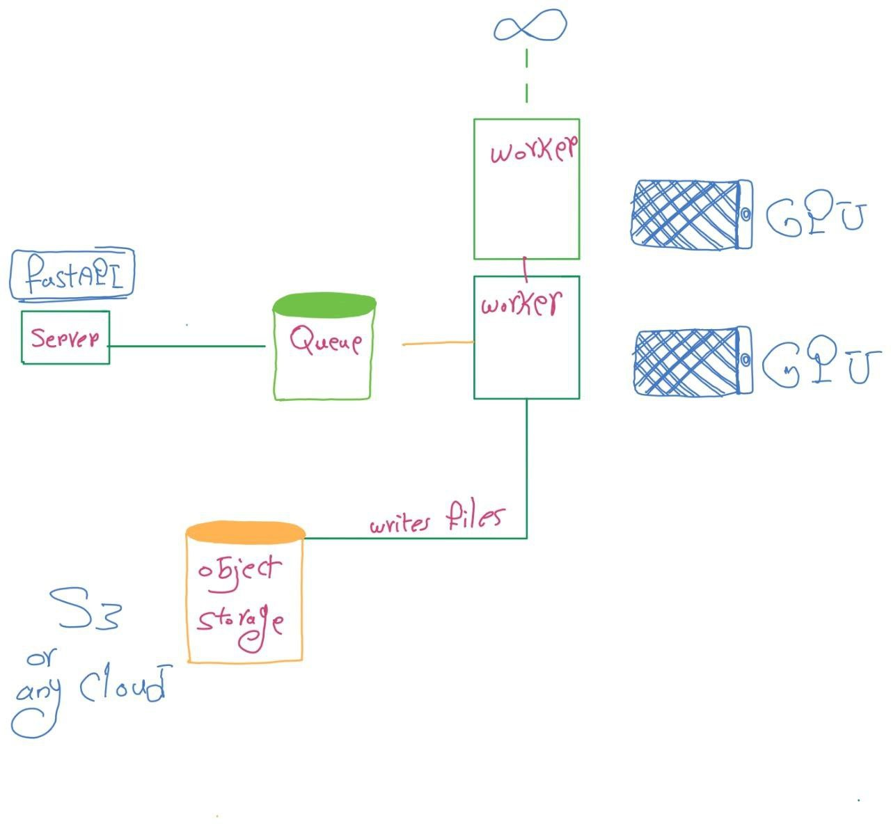

Certainly! Here's a simple and well-written README file template for your project:


---

# FastAPI Stable Diffusion Image Generator

## Introduction

This project leverages FastAPI and the Stable Diffusion model with Dramatiq to create images from text prompts and store them in cloud storage. It provides an easy-to-use API for generating images from text inputs.

## Technologies Used

- [FastAPI](https://fastapi.tiangolo.com/): A modern web framework for building APIs with Python.
- [Stable Diffusion](https://github.com/VITA-Group/Stable-Diffusion): A generative model for creating images from text prompts.
- [Dramatiq](https://dramatiq.io/): A distributed task processing library.
- [PyTorch](https://pytorch.org/): A deep learning framework used for running the Stable Diffusion model.
- [Pillow (PIL)](https://pillow.readthedocs.io/en/stable/): A Python Imaging Library used for image processing.

## Features

This project offers the following features:

- **Generate Images**: Create images from text prompts.
- **Guidance Scale**: Option to provide a negative prompt for guidance during image generation.
- **Customizable Inference Steps**: Specify the number of inference steps for image generation.
- **Callback Function**: Support for progress tracking using callback functions.

## Setup

1. Clone this repository to your local machine.

   ```bash
   git clone https://github.com/your-username/your-project.git
   ```

2. Install the required dependencies.

   ```bash
   pip install -r requirements.txt
   ```

3. Start the FastAPI server.

   ```bash
   uvicorn main:app --reload
   ```

4. The FastAPI server should now be running locally. You can access the API at `http://localhost:8000`.

## API Usage

### Generate Image

To generate an image from a text prompt, make a POST request to the `/generate-image/` endpoint with the following JSON data:

```json
{
  "prompt": "Your text prompt here",
  "negative_prompt": "Optional negative prompt for guidance",
  "num_steps": 50
}
```

- `prompt` (string, required): The text prompt for image generation.
- `negative_prompt` (string, optional): A negative prompt for guidance during generation.
- `num_steps` (integer, optional): The number of inference steps (default: 50).

The API will respond with a Base64-encoded image.

## Project Status

This project is currently in development and may receive updates and improvements in the future.

## Sources

- [FastAPI Documentation](https://fastapi.tiangolo.com/)
- [Stable Diffusion GitHub Repository](https://github.com/VITA-Group/Stable-Diffusion)
- [Dramatiq Documentation](https://dramatiq.io/)
- [PyTorch Documentation](https://pytorch.org/)
- [Pillow (PIL) Documentation](https://pillow.readthedocs.io/en/stable/)

## Other Information

Feel free to customize and extend this project to suit your needs. If you encounter any issues or have suggestions for improvements, please open an issue on the GitHub repository.

---

This README file provides an overview of the project, its features, setup instructions, API usage, and additional resources. Customize it with your project-specific details and ensure it is up to date with the latest changes in your project.